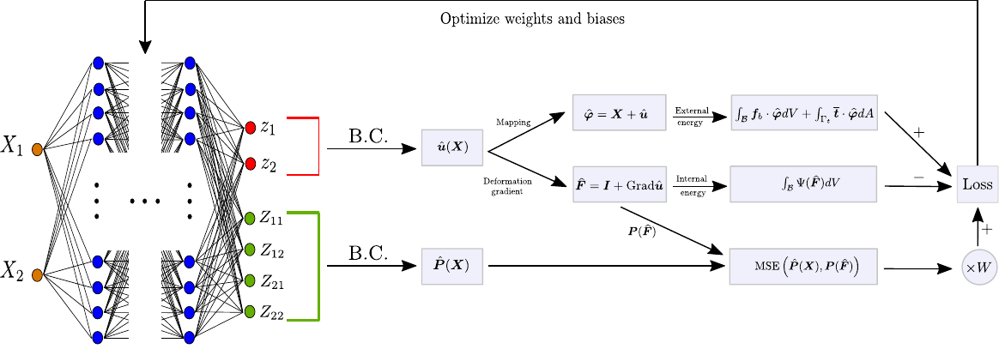

# The mixed deep energy method for resolving concentration features in finite strain hyperelasticity

  - Author: Jan N Fuhg
  - Organization: Cornell University

Here, we propose an extension to the Deep Energy Method (DEM)
to resolve stress concentrations for finite strain hyperelasticity[1]. The developed framework termed mixed
Deep Energy Method (mDEM) introduces stress measures as an additional output of the neural network to
the recently introduced pure displacement formulation[2].

<p align="center">

</p>


## Installation
This code requires an [Anaconda](https://www.anaconda.com/products/individual) or [Miniconda](https://docs.conda.io/en/latest/miniconda.html) environment with a recent Python version.
The complete repository can be cloned and installed locally. It is recommended to create a conda environment before installation. This can be done by the following the command line instructions

```
$ git clone https://github.com/FuhgJan/mixedDEM.git ./mixedDEM
$ cd mixedDEM
$ conda env create -f environment.yml
$ conda activate mixedDEM
$ python -m pip install . --user

```
The provided example can then be run with

```
$ python -m mdem
```

Outputs will be written to mixedDEM/outputs/vtk_files/ and can be opened with paraview.


## Dependencies

The code requires the following packages as imports:

 - [NumPy](http://numpy.scipy.org) for array handling
 - [Scipy](https://www.scipy.org/) for numerical solutions
 - [torch](https://pytorch.org/) for the neural network and automatic differentiation libraries
 - [MatPlotLib](https://matplotlib.org/) for graphical output
 - [pyevtk](https://github.com/pyscience-projects/pyevtk) for graphical output to paraview
 - [paraview](https://www.paraview.org/python/) for a graphical user interface
 - [triangle](https://rufat.be/triangle/) for numerical integration


## References
If you use part of this code consider citing:

[1] Fuhg, Jan N., and Nikolaos Bouklas. "The mixed deep energy method for resolving concentration features in finite strain hyperelasticity." Journal of Computational Physics 451 (2022): 110839.

[2] Nguyen-Thanh, Vien Minh, Xiaoying Zhuang, and Timon Rabczuk. "A deep energy method for finite deformation hyperelasticity." European Journal of Mechanics-A/Solids 80 (2020): 103874.


## License

This package comes with ABSOLUTELY NO WARRANTY. This is free
software, and you are welcome to redistribute it under the conditions of
the GNU General Public License
([GPLv3](http://www.fsf.org/licensing/licenses/gpl.html))

The contents are published under the 
Creative Commons Attribution-NonCommercial-ShareAlike 4.0 International License
([CC BY-NC-SA 4.0](http://creativecommons.org/licenses/by-nc-sa/4.0/))
